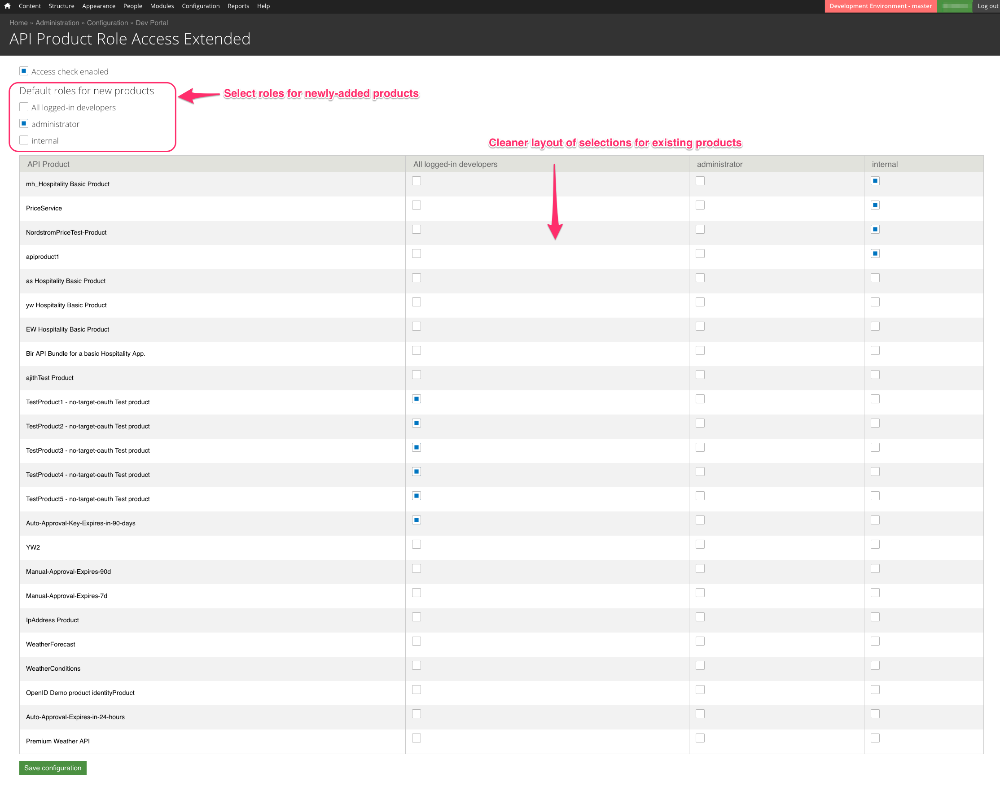

# API Product RBAC - Extended

This module provides Role-Based Access control to API Products for users in the Apigee
Edge Drupal-based developer portal. This module originated as a fork of the builtin
devconnect API Product Access module.

This module supplants that module, providing these extensions and improvements:

* "default" access for an API Product.
  When you add a new API Product, it will be exposed to a specific default set of roles. For
  example, if you set the default roles for new products to be "administrator", then all new users
  will not see any new products, even if they are marked public, unless and until you allow access
  to that product.  The original module always defaulted to exposing all "public" API Products to
  "any logged-in developer".  See [This question on the Apigee
  Community](https://community.apigee.com/questions/46219/api-product-role-access-default-value.html)

* better administrative form for configuration.
  The form is now a table, with checkboxes arranged in rows.  Example:

  

## Installing

You should download all the files for this module into a directory named
sites/all/modules/custom/apiproduct_access_extended .  Then enable the module as normal,
in the Drupal Module administration panel.

## Configuring

To configure the access and roles, login as Administrator, and then use Configuration >
Dev Portal > API Product Role Access Extended .  The interface should be mostly
self-explanatory from there.

The first set of checkboxes allows you to specify a set of roles that will have access
to any newly-added API Product. This is the "default set of roles" that will apply to an
API Product unless and until you explicitly provide roles for that product.

For example, if you want no users to be able to see any API Product until you explicitly
specifies roles for the product, tick no boxes under "Default roles".

## Compatibility

You could theoretically use this module along with the original devconnect apiproduct access module, but
it does not make much sense to do so.  If you use this module, you should disable the other module.

## Upgrade

There is no "upgrade" from the existing devconnect apiproduct access module.  If you
have previously used the devconnect apiproduct access module, there is no automatic
migration of settings from that module, to this one.  You will have to manually
reproduce the settings.

## Warranty

This software is provided "as is", without warranty of any kind, express or implied,
including but not limited to the warranties of merchantability, fitness for a particular
purpose and noninfringement. In no event shall the authors or copyright holders be
liable for any claim, damages or other liability, whether in an action of contract, tort
or otherwise, arising from, out of or in connection with the software or the use or
other dealings in the software.

## Support Status

This module is not a supported part of the Apigee Edge Drupal-based developer portal.
This module is open-source software. If you need assistance, you can try inquiring on
[The Apigee Community Site](https://community.apigee.com).  There is no service-level
guarantee for responses to inquiries regarding this module.

